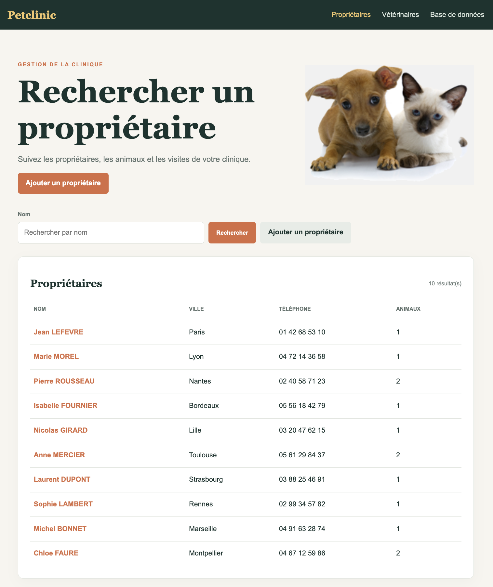
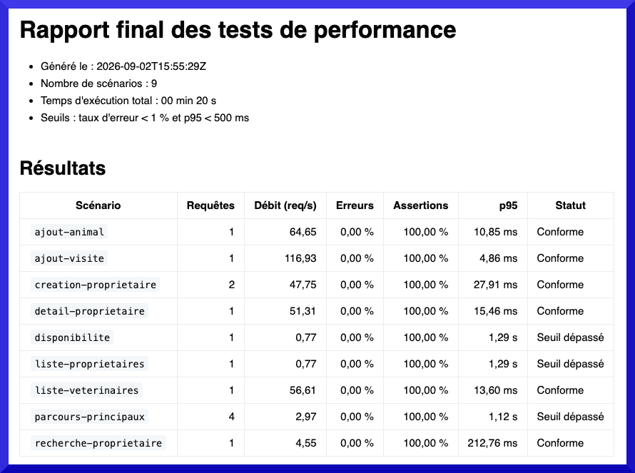

# Petclinic

Application web Spring Boot inspirée de [Spring Petclinic](https://github.com/spring-projects/spring-petclinic), entièrement proposée en français côté interface.

## Analyse de la reference

La référence est une application MVC Spring Boot construite autour de propriétaires, animaux, vétérinaires et visites.\
Elle utilise Spring Data JPA pour la persistance, Thymeleaf pour les écrans et initialise une base H2 en mémoire avec des données de démonstration.\
Cette version conserve ces parcours essentiels, mais retire les fonctionnalités hors périmètre (Maven, MySQL, PostgreSQL, Docker, cache et compilation CSS).

## Choix techniques

- Java 21
- Spring Boot 4.1
- Gradle uniquement
- Spring MVC, Thymeleaf, Spring Data JPA et Bean Validation
- H2 en mémoire, créée par `schema.sql` et initialisée par `data.sql`

## Démarrer

```shell
./gradlew bootRun
```

Puis ouvrir http://localhost:8080.



Écrans disponibles :

- `/proprietaires` : recherche et liste des propriétaires
- `/proprietaires/nouveau` : création d'un propriétaire
- `/proprietaires/{id}` : détail, ajout d'un animal et d'une visite ; le type de l'animal est sélectionné parmi les types disponibles en base
- `/veterinaires` : liste des vétérinaires
- `/h2-console` : console H2, JDBC URL `jdbc:h2:mem:petclinic`

## Connexion à la console H2

L'application doit être démarrée avant d'ouvrir la console, car la base de données est stockée en mémoire :

```shell
./gradlew bootRun
```

Ouvrir ensuite http://localhost:8080/h2-console et utiliser les valeurs suivantes :

| Champ | Valeur |
| --- | --- |
| Driver Class | `org.h2.Driver` |
| JDBC URL | `jdbc:h2:mem:petclinic` |
| User Name | `sa` |
| Password | laisser vide |

Les champs `Saved Settings` et `Setting Name` peuvent rester vides. Cliquer sur **Connect**.

La base H2 est recréée depuis `schema.sql`, puis rechargée avec les données de démonstration de `data.sql` à chaque redémarrage de l'application.

## Schéma de la base

Le fichier `src/main/resources/schema.sql` définit le schéma relationnel de l'application :

- les tables des propriétaires, animaux, visites, vétérinaires, spécialités et types d'animaux ;
- la table d'association `veterinaires_specialites` ;
- les clés primaires, clés étrangères, contraintes d'unicité et index des relations.

Hibernate ne génère pas le schéma (`spring.jpa.hibernate.ddl-auto: none`).\
Les types proposés dans le formulaire **Enregistrer un animal** sont chargés dynamiquement depuis la table `types_animaux`.

## Vérifier

```shell
./gradlew test
```

Pour démarrer l'application en vérifiant d'abord que son port est disponible :
```shell
just run
```

La recette contrôle le port backend `8080`.\
Si un processus Java, Node, NPM ou Vite l'utilise déjà, elle lui envoie un arrêt gracieux, puis force l'arrêt si
le port n'est pas libéré.\
Elle refuse d'arrêter automatiquement un autre type de processus.\

Le contrôle peut être testé sans démarrer l'application avec :
```shell
just test-ports
```

## Tests de performance

La documentation des tests de performance est disponible dans [`performance/README.md`](performance/README.md).\
Elle décrit l'installation de k6, la préparation des jeux de données et les tâches de lancement et de génération des rapports.


